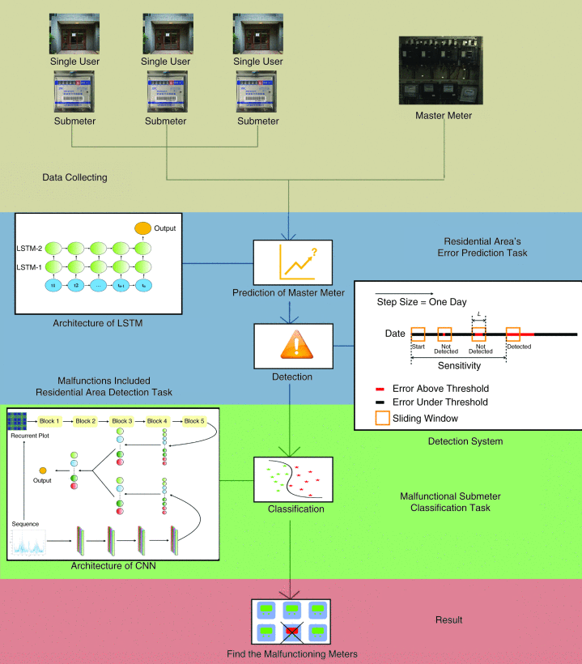

# <i class="fa fa-fw fa-copy"></i> Miscs

## Visited university list

<table class='imgtable'>
  <tr>
    <td align="left">
      

        <a> China </a> 
        Shandong University (Jinan)  
        Shandong University (Weihai)  
        Ocean University of China  
      

    </td>
  </tr>
</table>

## E-sports

<table class='imgtable'>
  <tr>
    <td align="center" style="width:200px">
      
    </td>
    <td align="left">
      

        <a href="http://likeyhnbm.github.io/publications/electric">
        <b>Deep Learning Detection of Inaccurate Smart Electricity Meters: A Case Study</b></a> 
        Ming Liu*, Dongpeng Liu*, <b>Guangyu Sun</b>, Yi Zhao, Duolin Wang, Fangxing Liu, Xiang Fang, Qing He, Dong Xu. 
        <i>IEEE Industrial Electronics Magazine</i> 
        [<a href="https://ieeexplore.ieee.org/document/9300285">Paper</a>]
      

    </td>
  </tr>
  <tr>
    <td align="center" style="width:200px">
     
    </td>
    <td align="left">
      

        <a href="http://likeyhnbm.github.io/publications/water">
        <b>Assessing environmental oil spill based on fluorescence images of water samples and deep learning</b> </a> 
        Dongpeng Liu, Ming Liu, <b>Guangyu Sun</b>, Zhiqian Zhou, Duolin Wang, Fei He, Jiaxin Li, Ryan Gettler, Eric Brunson, Jeffery Steevens, Dong Xu 
        <i>Journal of Environmental informatics</i> 
        [<a href="https://pubs.er.usgs.gov/publication/70243648">Paper</a>]
      

    </td>
  </tr>
</table>

