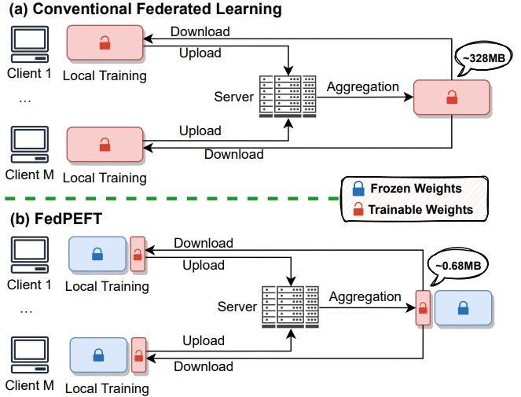

# <i class="fa fa-fw fa-copy"></i> Publications

## Papers

<ul>

  <li> Is It a Trap? A Large-scale Empirical Study And Comprehensive Assessment of Online Automated Privacy Policy Generators for Mobile Apps </li>

</ul>

## Preprints

<table class='imgtable'>
  <tr>
    <td align="center" style="width:200px">
    
    </td>
    <td align="left">
      

        <a href="http://likeyhnbm.github.io/publications/FedPEFT">
        <b>Conquering the Communication Constraints to Enable Large Pre-Trained Models in Federated Learning</b> </a>
        <b>Guangyu Sun</b>, Matias Mendieta, Taojiannan Yang, Chen Chen 
        [<a href="https://arxiv.org/abs/2210.01708">Paper</a>]
      

    </td>
  </tr>
  <tr>
    <td align="center" style="width:200px">
     
    </td>
    <td align="left">
      

        <a href="http://likeyhnbm.github.io/publications/AnomalyCrossing">
        <b>Anomaly Crossing: New Horizons for Video Anomaly Detection as Cross-domain Few-shot Learning</b></a> 
        <b>Guangyu Sun*</b>, Zhang Liu*, Lianggong Wen, Jing Shi, Chenliang Xu 
        [<a href="https://arxiv.org/abs/2112.06320">Paper</a>]
        [<a href="https://github.com/likeyhnbm/AnomalyCrossing">Code</a>]
      

    </td>
  </tr>
</table>

